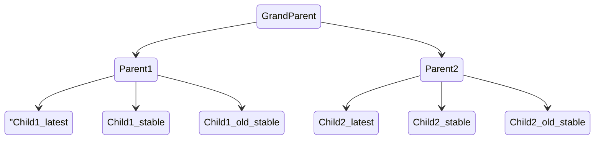

# Multi-Agent configuration for Netdata

Multi agent netdata configuration, this creates a 3 level grandparent/parent/children setup:



## Setup

- Create a `.env` file with the required claim tokens (if you want to claim all agents to the same space, put the same token value):

```txt
CLAIM_TOKEN_ENV=<TOKEN_VALUE>
CLAIM_TOKEN_URL=<NETDATA-URL> // for public production env use: https://app.netdata.cloud
```

- start docker compose

```shell
> docker compose up
```
